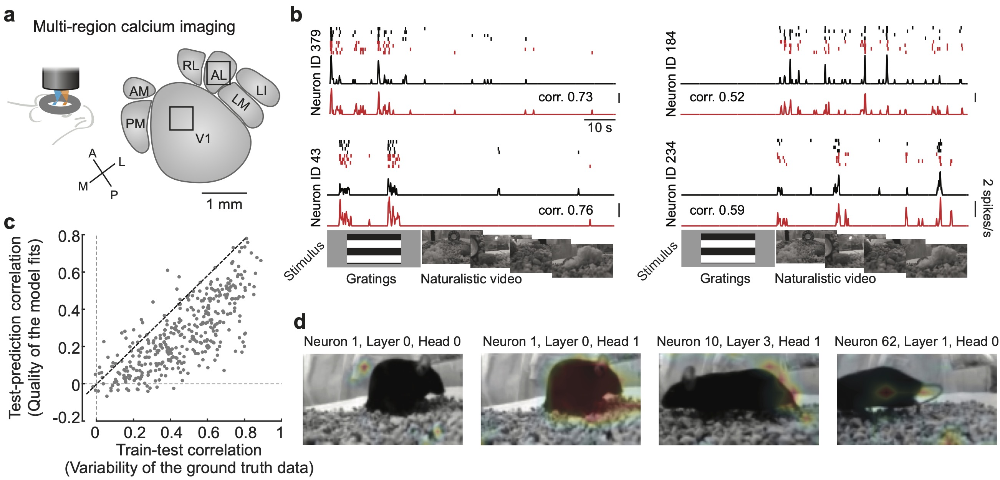

# Neuroformer 
### A GPT based multi-modal, multi-task transformer model for pretraining and downstream inference involving brain data.
<p align="center">
  
</p>

<!--  -->

<!-- <p align="center">
### A GPT based multi-modal, multi-task transformer model for pretraining and downstream inference involving brain data.
</p> -->


A GPT based multi-modal, multi-task transformer model for pretraining and downstream inference involving brain data.

For questions regarding use of the model, feel free to contact antonis@ucsb.edu.

## Installation

```
conda create -n neuroformer
conda activate neuroformer
pip install -r requirements.txt
```

The Smith Lab has open-sourced two datasets for use with this model. Special thanks to Yiyi Yu and Joe Canzano 🙂

- **V1AL**: Neuronal activity from the primary visual cortex and a higher visual area (V1 + AL), recorded from awake mice viewing visual stimuli.

- **Visnav (lateral)**: Recordings from the lateral visual cortex, spanning V1 and multiple higher visual areas, from mice engaged in a visually-guided navigation task. This dataset includes additional behavioral variables such as speed, and eye gaze (phi, th).

### Integrating your own data

For a closer look at the data format, refer to the `neuroformer.datasets.load_visnav()` function (used for example in the `neuroformer_train.py`). 

The function needs to return:

- `data`: A dictionary with:
  - Required key: `'spikes'` of shape N_neurons x N_timesteps (bins) of size dt.
  - Optional keys:
    - `'frames'` of shape N_frames x N_timesteps (bins) of size dt. If your trial structure/stimulus format differs from the ones provided in the script, you can write your own `callback` function.
    - `'behavior variables'` of shape N_timepoints, denoting the behavioral variable of interest (e.g. speed, phi, thi, etc). This key can be anything you want, as long as you specify it in the config file.
- `intervals`: An array of shape N_timepoints denoting all intervals/time bins of the data. This is used to split the data into train/val/test sets.
- `train_intervals`: The corresponding train intervals.
- `test_intervals`: The corresponding test intervals.
- `finetune_intervals`: The corresponding finetune intervals (very small amount).
- `callback`: This function is passed to the dataloader, and parses your stimulus according to the relationship it has to your response (spikes). This enables the integration of virtually any stimulus/response experiment structure. Most callbacks only require 4-5 lines of code, see the existing ones to get an idea.


## Modalities and Task Configuration

In the `mconf.yaml` file, you can specify additional modalities other than spikes and frames. For example behavioral features. The model will *automagically* create add/remove the necessary layers to the model. Additionally, you can specify any downstream objective, and choose between a 

Here's what each field represents:

- **Modalities**: Any additional modalities other than spikes and frames.
- **Behavior**: The name of the modality type.
- **Variables**: The name of the modality.
  - **Data**: The data of the modality in shape (n_samples, n_features).
  - **dt**: The time resolution of the modality, used to index n_samples.
  - **Predict**: Whether to predict this modality or not. If you set predict to false, then it will not be used as an input in the model, but rather to be predicted as an output.
  - **Objective**: Choose between *regression* or *classification*. If classification is chosen, the data will be split into classes according to **dt**.

To pretrain on the visnav dataset, you can run the following code:
```
python neuroformer_train.py --lateral --config configs/NF/pretrain_visnav.yaml
``` 


## Pretraining



You can jointly pretrain the model using the spike causal masking (SCLM) objective and any other downstream task. The trainer will automatically save the model that does best for each corresponding objective (if you also include a holdout dataset). For example model.pt (normal pretraining objective), model_speed.pt, etc.


## Finetuning

<div style="text-align: center;">
    
    <br>
    <figcaption style="font-size: 0.9em; color: grey;">Holdout predictions of Neuroformer jointly Trained on <strong>Speed</strong> and <strong>Gaze (phi, thi)</strong></figcaption>
</div>


To finetune the model on one of the behavioral variables (speed, phi, thi), you can run the following code:
```
python neuroformer_train.py --lateral --finetune --loss_brop speed phi th --config configs/NF/finetune_visnav_all.yaml
```

`--loss_bprop` tells the optimizer which losses to backpropagate.  
`--config` Here only difference between the two is adding Modalities.Behavior.Variables.(Data, dt, Predict, Objective) to the config file.

## Inference

To generate new spikes:
```
python neuroformer_inference.py --dataset lateral --ckpt_path "model_directory" --predict_modes speed phi th
```

The `behavior_preds()` function in `neuroformer_inference.py` can be used to generate predictions for any of the behavioral variables, by setting `block_type` and `objecttive`, which is automatically inferred by the config file and the `args.predict_mode` options. Note that if you want to generate predictions for a variable that was not used in the pretraining, you will need to add it to the config file (and preferably **finetune** on it first).