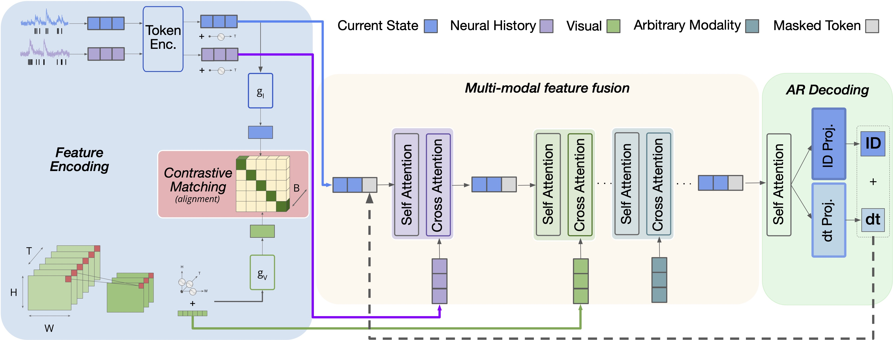
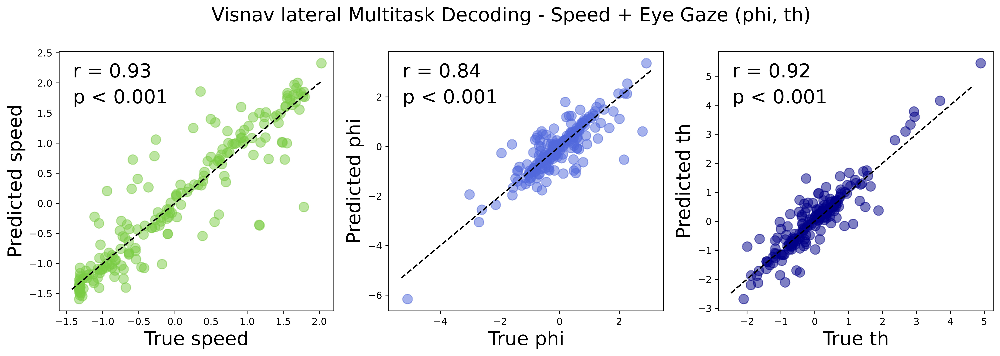

# Neuroformer

### A GPT based multi-modal, multi-task transformer model for pretraining and downstream inference involving brain data.



A GPT based multi-modal, multi-task transformer model for pretraining and downstream inference involving brain data.

For questions regarding use of the model, feel free to contact antonis@ucsb.edu.

## Installation

```
conda create -n neuroformer
conda activate neuroformer
pip install -r requirements.txt
```

## Data

The Smith Lab has open-sourced two datasets for use with this model:

- **V1AL**: This dataset includes neuronal activity from the primary visual cortex and a higher visual area (V1 + AL), recorded from awake mice viewing visual stimuli.

- **Visnav (lateral)**: This dataset contains recordings from the lateral visual cortex, spanning V1 and multiple higher visual areas, from mice engaged in a visually-guided navigation task. This dataset contains additional behavioral variables, speed, and eye gaze (phi, th).

## Modalities and Task Configuration

In the `mconf.yaml` file, you can specify additional modalities other than spikes and frames. For example behavioral features. The model will automatically create add/remove the necessary layers to the model. Additionally, you can specify any downstream objective, and choose between a 

Here's what each field represents:

- **Modalities**: Any additional modalities other than spikes and frames.
- **Behavior**: The name of the modality type.
- **Variables**: The name of the modality.
  - **Data**: The data of the modality in shape (n_samples, n_features).
  - **dt**: The time resolution of the modality, used to index n_samples.
  - **Predict**: Whether to predict this modality or not. If you set predict to false, then it will not be used as an input in the model, but rather to be predicted as an output.
  - **Objective**: Choose between *regression* or *classification*. If classification is chosen, the data will be split into classes according to **dt**.

To pretrain on the visnav dataset, you can run the following code:
```
python neuroformer_train.py --lateral --config configs/NF/pretrain_visnav.yaml
``` 


## Pretraining


You can jointly pretrain the model using the spike causal masking (SCLM) objective and any other downstream task. The trainer will automatically save the model that does best for each corresponding objective (if you also include a holdout dataset). For example model.pt (normal pretraining objective), model_speed.pt, etc.


## Finetuning




To finetune the model on one of the behavioral variables (speed, phi, thi), you can run the following code:
```
python neuroformer_train.py --lateral --finetune --loss_brop speed phi th --config configs/NF/finetune_visnav_all.yaml
```
`--loss_bprop` tells the optimizer which losses to backpropagate.  
`--config` Here only difference between the two is adding Modalities.Behavior.Variables.(Data, dt, Predict, Objective) to the config file.


